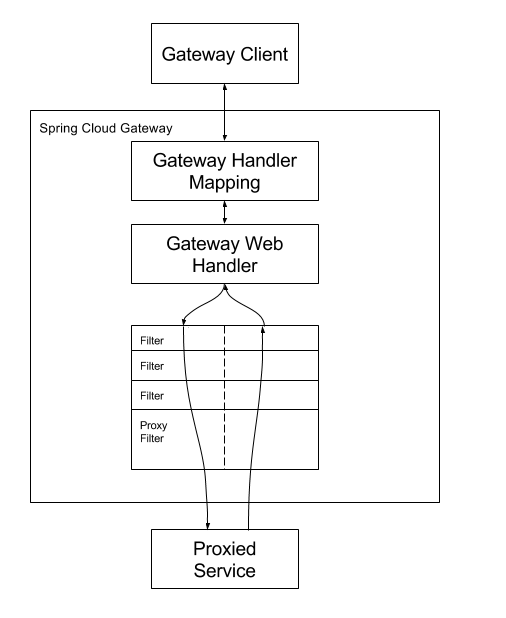

This guide walks you through getting started with the Spring Cloud Gateway.

The Spring Cloud Gateway is a library for building an API Gateway on top of Spring MVC. Spring Cloud Gateway aims to provide a simple, yet effective way to route to APIs and provide cross cutting concerns to them such as: security, monitoring/metrics, and resiliency.

Spring Cloud Gateway features:
- Built on Spring Framework 5, Project Reactor and Spring Boot
- Able to match routes on any request attribute.
- Predicates and filters are specific to routes.
- Hystrix Circuit Breaker integration.
- Spring Cloud DiscoveryClient integration
- Easy to write Predicates and Filters
- Request Rate Limiting
- Path Rewriting

#### How It Works

The following diagram provides a high-level overview of how Spring Cloud Gateway works:

Clients make requests to Spring Cloud Gateway. If the Gateway Handler Mapping determines that a request matches a route, it is sent to the Gateway Web Handler. This handler runs the request through a filter chain that is specific to the request. The reason the filters are divided by the dotted line is that filters can run logic both before and after the proxy request is sent. All “pre” filter logic is executed. Then the proxy request is made. After the proxy request is made, the “post” filter logic is run.

#### Glossary

*Route* : The basic building block of the gateway. It is defined by an ID, a destination URI, a collection of predicates, and a collection of filters. A route is matched if the aggregate predicate is true.

*Predicate* : This is a Java 8 Function Predicate. The input type is a Spring Framework ServerWebExchange. This lets you match on anything from the HTTP request, such as headers or parameters.

*Filter* : These are instances of Spring Framework GatewayFilter that have been constructed with a specific factory. Here, you can modify requests and responses before or after sending the downstream request.