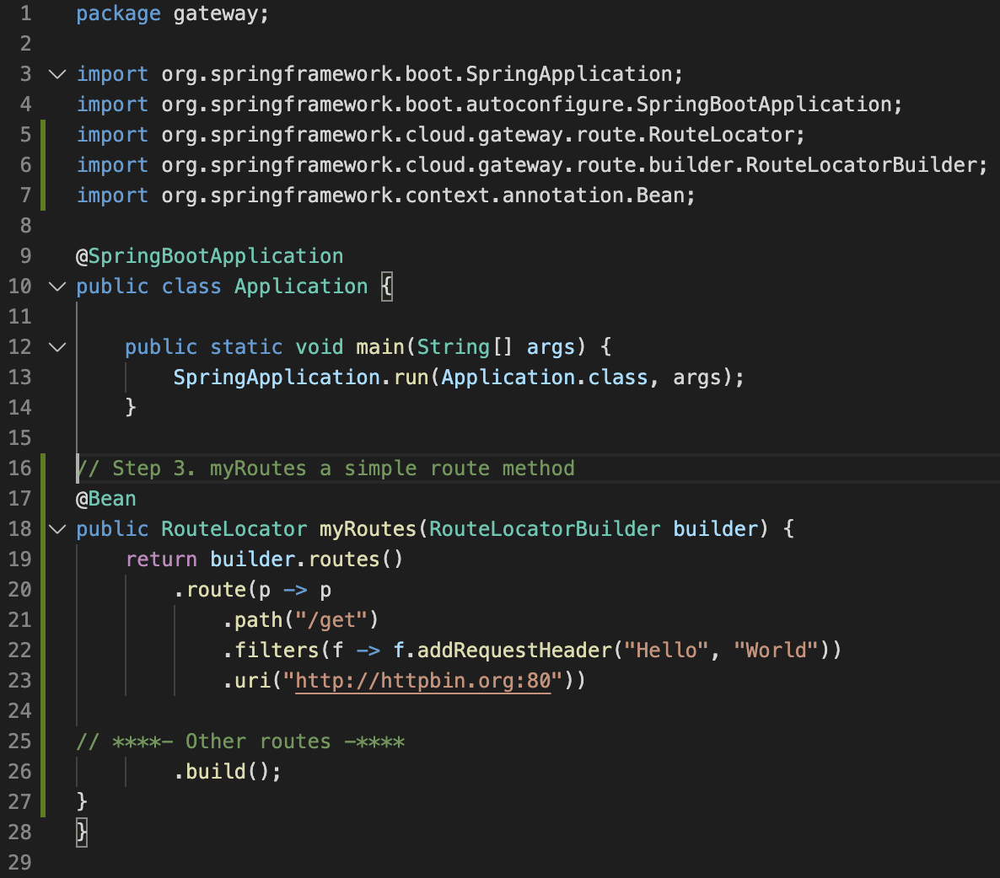

The Spring Cloud Gateway uses routes in order to process requests to downstream services. In this guide we will route all of our requests to HTTPBin. Routes can be configured a number of ways but for this guide we will use the Java API provided by the Gateway.

To get started, we will create a new `Bean` of type `RouteLocator` in `Application.java`.

This `Bean` will  live in `src/main/java/gateway/Application.java`. In tshhe example bellow, `myRoutes` method takes in a `RouteLocatorBuilder` which can be used to create routes. 
> **Example ::**
```
@Bean
public RouteLocator myRoutes(RouteLocatorBuilder builder) {
    return builder.routes().build();
}
```

In addition to just creating routes, the `RouteLocatorBuilder` allows you to add predicates and filters to your routes so you can route handle based on certain conditions as well as alter the request/response as you see fit.


Now, let's create a route that when a request is made to the Gateway at `/get` the request gets sent to `https://httpbin.org/get`. We will include a filter to add the request header `Hello` with the value `World` to the request before it is routed.

In in `src/main/java/gateway/Application.java` import `Bean`, `RouteLocator`, and `RouteLocatorBuilder`. Place them below the other import statements.

```editor:insert-lines-before-line
file: ~/gs-gateway/initial/src/main/java/gateway/Application.java/Application.java
line: 5
text: |
    import org.springframework.cloud.gateway.route.RouteLocator;
    import org.springframework.cloud.gateway.route.builder.RouteLocatorBuilder;
    import org.springframework.context.annotation.Bean;
```

Now, add your `myRoutes` method inside of the `Application` class already in the file below `public static void main`.


```editor:insert-lines-before-line
file: ~/gs-gateway/initial/src/main/java/gateway/Application.java/
line: 16
text: |
    @Bean
    public RouteLocator myRoutes(RouteLocatorBuilder builder) {
        return builder.routes()
            .route(p -> p
                .path("/get")
                .filters(f -> f.addRequestHeader("Hello", "World"))
                .uri("http://httpbin.org:80"))
            .build();
    }
```

Your file should look like bellow (click to expand)
   