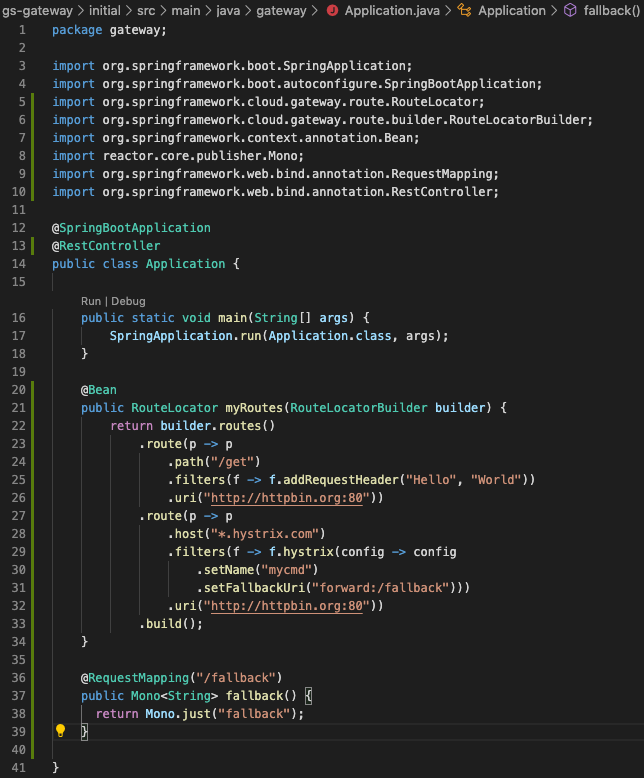

To return a response with the body `fallback` instead of `504` modify our Hystrix filter to provide a URL to call in the case of a timeout.

`src/main/java/gateway/Application.java`

```editor:insert-lines-before-line
file: ~/gs-gateway/initial/src/main/java/gateway/Application.java
line: 31
text: |
        // uri=/fallback
        .setFallbackUri("forward:/fallback")))
```

Now when the Hystrix wrapped route times out it will call `/fallback` in the Gateway app. Lets add the `/fallback` endpoint to our application.

In `Application.java` import the `Mono` reactive stream,  a `@RestController` and `@RequestMapping` to the class under the other import statements.

```editor:insert-lines-before-line
file: ~/gs-gateway/initial/src/main/java/gateway/Application.java
line: 9
text: |
        import reactor.core.publisher.Mono;
        import org.springframework.web.bind.annotation.RequestMapping;
        import org.springframework.web.bind.annotation.RestController;


```

Place the annotation `@RestController` in the line above `public class Application {` such as:

```editor:insert-lines-before-line
file: ~/gs-gateway/initial/src/main/java/gateway/Application.java
line: 12
text: |
        @RestController
```

Next add the following below your `myRoutes` function in 
`src/main/java/gateway/Application.java`

> Note: adding \n for readability in response

```editor:insert-lines-before-line
file: ~/gs-gateway/initial/src/main/java/gateway/Application.java
line: 40
text: |
        @RequestMapping("/fallback")
        public Mono<String> fallback() {
        return Mono.just("fallback\n");
        }
```

To test this new fallback functionality, **restart the application
dont forget to (control + C) on the terminal first**
```execute-1
mvn spring-boot:run
```

And again issue the following cURL command

```execute-2
curl --dump-header - --header 'Host: www.hystrix.com' http://localhost:8080/delay/3
```

With the fallback in place, we now see that we get a `200` back from the Gateway with the response body of `fallback`. 

```
HTTP/1.1 200 OK
transfer-encoding: chunked
Content-Type: text/plain;charset=UTF-8

fallback
```

Your file should look like bellow (click to expand)
